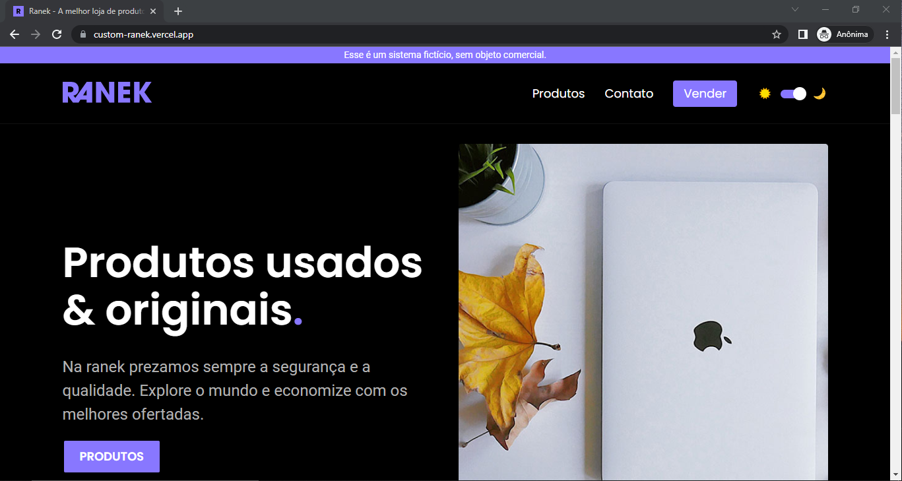

<h1 align="center">📱 Ranek 🛒 </h1>

E-commerce para a compra e venda de produtos eletrônicos.

 <a href="#sobre">Sobre</a> •
 <a href="#diferenciais">Diferenciais</a> •
 <a href="#aprendizados">Aprendizados</a> •
 <a href="#tecnologias">Tecnologias</a> •
 <a href="#instalacao">Instalação</a>

  <h1>📎 Sobre. </h1>
  

      A Ranek é a recriação do projeto <a href="https://ranek.origamid.dev/">Ranek Origamid</a> com tecnologias, funções e layout totalmente diferentes. A readaptação       do projeto tem o objetivo de mostrar minhas habilidades e conhecimentos sobre cada tecnologia adquirido no periodo de estudo. Durante todo o desenvolvimento           busquei ferramentas e bibliotecas que me auxiliasse na produtividade e organização do código, mas sem depender totalmente delas. Também apliquei e aprimorei           minhas experiências, vivências e maturidade em todo o projeto.
  

  

      Para ver o resultado final basta acessar: <a href="https://custom-ranek.vercel.app/">Ranek online 🛒</a>. Lembre-se, os dados da API são apagados a cada 20           minutos.
  

  
  

      <em>Pse: Como o Redux é uma biblioteca grande e abrange diferentes funcionalidades, sempre busco manter atualizado as partes onde utilizo essa ferramenta no           projeto.</em>     
  

        

  <h1>📌 Diferenciais. </h1>
  

      Aqui se encontra as principais diferenças do sitema original para esse. Os diferencias aqui citados são referente as tecnologias usada no projeto, para ver as         diferenças em relação ao layout explore o sistema online clicando <a href="https://custom-ranek.vercel.app/">aqui</a>.
  

  

      <h3>React & Typescript & Redux.</h3>
      

          Todo o sistema foi desenvolvido usando o react integrado com o typescript. Já o redux foi responsável por controlar toda parte de requisição da loja. Para             facilitar as requisições foi utilizado a biblioteca axios.
      

  

  

      <h3>Styled components & Tema dark/light & Layout.</h3>
      

          A biblioteca Styled components foi responsável por toda parte de estilização dos componentes e pelo tema dark e light. O layout foi totalmente remodelado com           o objetivo de melhorar a estética, suportar o tema e ser responsivo.
      

  

  

      <h3>Eslint & Prettier.</h3>
      

          Com o ojetivo de manter o código organizado, com padrões e identado, as ferramentas eslint e prettier foram utilizadas.
      

  

  

      <h3>Figma.</h3>
      

          A ferramenta figma foi usada para prototipar parte do sistema. Acesse ela pelo figma clicando 
          <a href="https://www.figma.com/file/NHO4RzF25O2C1Vojjxoyjt/ranek?node-id=0%3A1">aqui</a>.
      

  

  

      <h3>Bibliotecas.</h3>
      

          Algumas blbiotecas usadas: react-hot-toast, react-switch, phosphor-react, qrcode.react.
      

  

 <h1>📚 Aprendizados. </h1>
 <ul>
  <li>Importância da documentação.</li>
  <li>Ações assíncrona com o redux.</li>
  <li>Interceptadores axios.</li>
  <li>Configuração e instalação do eslint com o prettier.</li>
  <li>Padronização do projeto.</li>
  <li>Necessidade de se criar hooks cutomizados.</li>
  <li>Compreensão de hooks como: useRef, useContent e useCallback.</li>
  <li>Tipagem de items com o typescript.</li>
  <li>Animações com css.</li>
 </ul>

    

  <h1>🛠 Tecnologias.</h1>
  

    
    
    
    
     
    
    

    

   <h1>ℹ️ Instalação.</h1>
  <ul>
    <li>
      
Clone o projeto e acesse a pasta do mesmo.

      <code>
          $ git clone https://github.com/souzzs/custom-ranek.git
      </code>
    </li>
    <li>
      
Instale as dependências

      <code>
          $ npm install
      </code>
    </li>
    <li>
      
Inicie o projeto

      <code>
          $ npm start
      </code>
    </li>
  </ul>

  

  <h1>✏️ Autor.</h1>
  
Desenvolvimento por <a href="https://github.com/souzzs">Caio Souza</a>.

  

    
    
    
  

